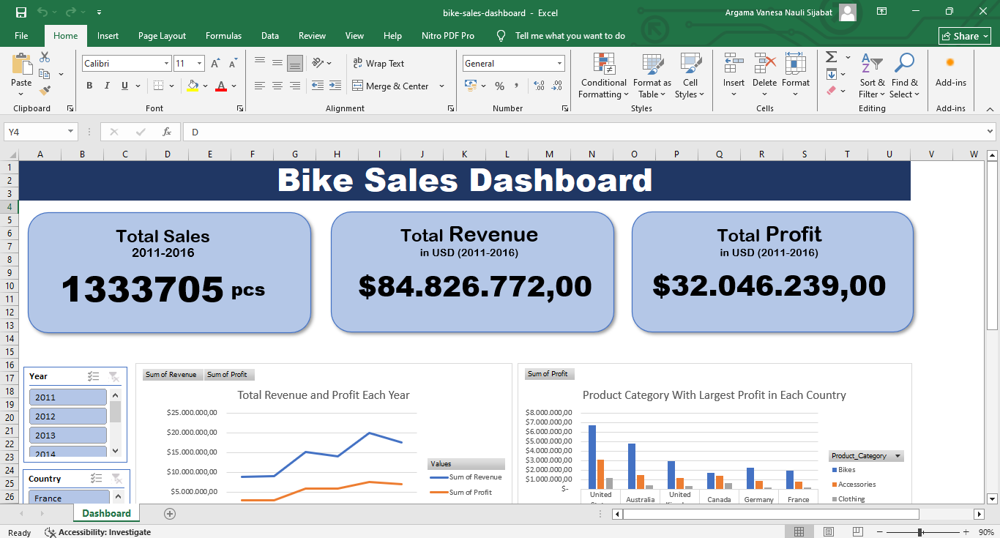
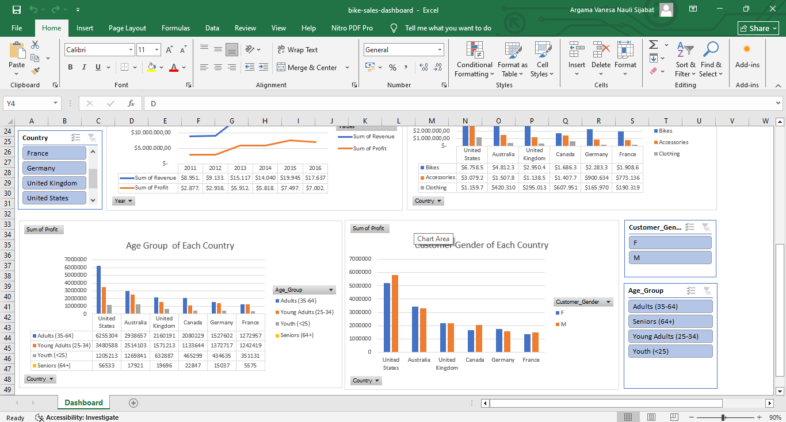

# Bike Sales Dashboard

---

## Data Cleaning & Quality Log
* **Deskripsi Dataset Awal:** Terdapat 18 kolom pada dataset dimana mencakup tanggal penjualan; demografi pelanggan (usia, kategori usia, dan gender); lokasi penjualan (negara dan state); detail produk (kategori, sub-kategori, dan nama produk); order quantity; unit cost; unit price); revenue; cost; dan profit.
* **Volume Data:** Terdapat total **112.036 data** transaksi di dalam dataset awal.
* **Data Duplikat:** Ditemukan sebanyak **1.000 data duplikat** (sekitar 8% dari keseluruhan data). Proses *delete duplicate* telah dilakukan dan karena jumlahnya yang sedikit, penghapusan ini **tidak berpengaruh secara signifikan** terhadap hasil analisis data akhir.
* **Validitas & Konsistensi Data:** Setelah diaudit, **tidak ditemukan *missing data*** (data kosong), tidak ada *value* data yang tidak konsisten, serta tidak ditemukan *value* yang tidak masuk akal (semua data berada dalam rentang batas logis).

---

## Pertanyaan Bisnis yang Ingin Dijawab
Projek ini dirancang untuk menjawab dua kebutuhan analisis utama:
1. **Analisis Performa & Produk:** Bagaimana tren performa penjualan produk antar tahun berdasarkan *revenue* dan *profit*? Serta kategori produk apa yang paling mendominasi *profit* di tiap-tiap negara?
2. **Analisis Demografi Pelanggan:** Bagaimana profil demografi pelanggan (*Gender* & Usia) berkontribusi terhadap *profit* di negara (*country*) tertentu?

---

##  Dashboard

---

## Business Insights
* **Tren Performa Tahunan:** Baik  *revenue* mapupun *profit* secara tahunan dari 2011 hingga 2016 menunjukan tren peningkatan dengan peak secara keseluruhan terjaid di tahun 2015. Tidak terlihat adanya kejadian *revenue* meningkat tetapi *profit* menurun. Selain itu **bikes** merupakan kategori produk yang mendominasi kontribusi profit secara konsisten di setiap negara diikuti dengan **accessories**. Temuan ini menunjukkan bahwa penjualan produk *bikes* masih menjadi penggerak utama bisnis, sementara produk  *accessories* berperan sebagai sumber profit tambahan
* **Profil Pelanggan Berdasarkan Negara:** Kategori usia **Adults (35-64 tahun)** dan **Young Adults (25-34 tahun)** mendominasi profit penjualan di setiap negara secara konsisten. Selain itu pelanggan **Male** lebih banyak berkontribusi pada profit dibandingkan **Female** pada hampir semua negara kecuali di Jerman. Berdasarkan kedua hal ini dapat disimpulan target market terbesar penjualan didominasi oleh pelanggan usia produktif (25–64 tahun), khususnya pelanggan pria.

---

## Struktur Repositori
* `data/` : Berisi file data mentah (*raw data*).
* `dashboard/` : File dashboard Microsoft Excel (`.xlsx`)
* `images/` : Dokumentasi visual atau gambar dashboard untuk keperluan operasional.
